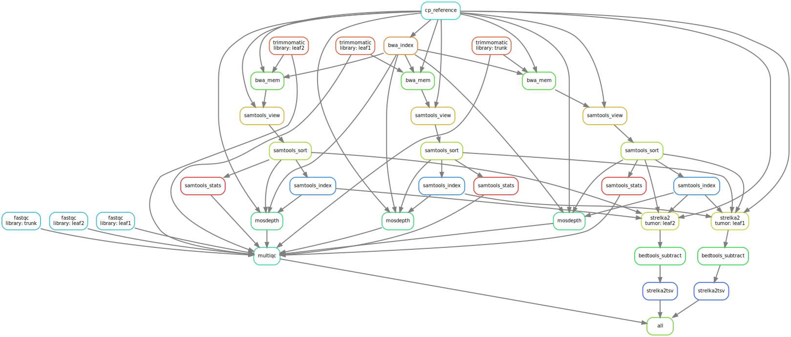

```{r setup, include=FALSE}
rm(list = ls()) ; invisible(gc()) ; set.seed(42)
library(knitr)
library(kableExtra)
if(knitr:::is_html_output()) options(knitr.table.format = "html") 
if(knitr:::is_latex_output()) options(knitr.table.format = "latex") 
library(tidyverse)
theme_set(bayesplot::theme_default())
opts_chunk$set(echo = F, message = F, warning = F, fig.height = 6, fig.width = 8,
               cache = F, cache.lazy = F)
```

[`singularity` & `snakemake`](https://github.com/sylvainschmitt/snakemake_singularity) workflow for a lecture at ECOFOG.

```{r dag}

```


# Installation

- [x] Python ≥3.5
- [x] Snakemake ≥5.24.1
- [x] Golang ≥1.15.2
- [x] Singularity ≥3.7.3
- [x] This workflow

```{bash, eval=F, echo=T}
# Python
sudo apt-get install python3.5
# Snakemake
sudo apt install snakemake`
# Golang
export VERSION=1.15.8 OS=linux ARCH=amd64  # change this as you need
wget -O /tmp/go${VERSION}.${OS}-${ARCH}.tar.gz https://dl.google.com/go/go${VERSION}.${OS}-${ARCH}.tar.gz && \
sudo tar -C /usr/local -xzf /tmp/go${VERSION}.${OS}-${ARCH}.tar.gz
echo 'export GOPATH=${HOME}/go' >> ~/.bashrc && \
echo 'export PATH=/usr/local/go/bin:${PATH}:${GOPATH}/bin' >> ~/.bashrc && \
source ~/.bashrc
# Singularity
mkdir -p ${GOPATH}/src/github.com/sylabs && \
  cd ${GOPATH}/src/github.com/sylabs && \
  git clone https://github.com/sylabs/singularity.git && \
  cd singularity
git checkout v3.7.3
cd ${GOPATH}/src/github.com/sylabs/singularity && \
  ./mconfig && \
  cd ./builddir && \
  make && \
  sudo make install
# snakemake Lecture
git clone git@github.com:sylvainschmitt/snakemakeLecture.git
cd snakemakeLecture
```

# Data

Run `get_data.sh` in the `data` directory.

```{bash, eval=F, echo=T}
git clone git@github.com:sylvainschmitt/generateMutations.git
cd generateMutations/data
sh get_data.sh
cd ..
snakemake --use-singularity --cores 4
mv results/reference/ ../
mv results/reads/ ../
mv results/mutations/ ../
cd ..
rm -rf generateMutations
```

# Usage

## Locally

```{bash, eval=F, echo=T}
snakemake -np -j 3 --resources mem_mb=10000 # dry run
snakemake --dag | dot -Tsvg > dag/dag.svg # dag
snakemake --use-singularity -j 3 --resources mem_mb=10000 # run
```

## HPC

```{bash, eval=F, echo=T}
module load bioinfo/snakemake-5.25.0 # for test on node
snakemake -np # dry run
sbatch job.sh # run
snakemake --dag | dot -Tsvg > dag/dag.svg # dag
```

# Workflow

## Reference

*Copy and index reference.*

### [cp_reference](https://github.com/sylvainschmitt/snakemakeLecture/blob/main/rules/cp_reference.smk)

  - Tools: `cp`

### [bwa_index](https://github.com/sylvainschmitt/snakemakeLecture/blob/main/rules/bwa_index.smk)

  - Tools: [`BWA index`](http://bio-bwa.sourceforge.net/bwa.shtml)
  - Singularity:
    oras://registry.forgemia.inra.fr/gafl/singularity/bwa/bwa:latest

## Reads

*Trim and quality check reads.*

### [trimmomatic](https://github.com/sylvainschmitt/snakemakeLecture/blob/main/rules/trimmomatic.smk)

* Tools: [`Trimmomatic`](http://www.usadellab.org/cms/uploads/supplementary/Trimmomatic/TrimmomaticManual_V0.32.pdf)
* Singularity: oras://registry.forgemia.inra.fr/gafl/singularity/trimmomatic/trimmomatic:latest

### [fastqc](https://github.com/sylvainschmitt/snakemakeLecture/blob/main/rules/fastqc.smk)

* Tools: [`fastQC`](https://www.bioinformatics.babraham.ac.uk/projects/fastqc/Help/)
* Singularity: docker://biocontainers/fastqc:v0.11.9_cv8

## Alignments

*Align reads against reference, mark duplicated, and report alignment quality.*

### [bwa_mem](https://github.com/sylvainschmitt/snakemakeLecture/blob/main/rules/bwa_mem.smk)

* Tools: [`BWA mem`](http://bio-bwa.sourceforge.net/bwa.shtml)
* Singularity: oras://registry.forgemia.inra.fr/gafl/singularity/bwa/bwa:latest

### [samtools_view](https://github.com/sylvainschmitt/snakemakeLecture/blob/main/rules/samtools_view.smk)

* Tools: [`Samtools view`](http://www.htslib.org/doc/samtools-view.html)
* Singularity: oras://registry.forgemia.inra.fr/gafl/singularity/samtools/samtools:latest

### [samtools_sort](https://github.com/sylvainschmitt/snakemakeLecture/blob/main/rules/samtools_sort.smk)

* Tools: [`Samtools sort`](http://www.htslib.org/doc/samtools-sort.html)
* Singularity: oras://registry.forgemia.inra.fr/gafl/singularity/samtools/samtools:latest

### [samtools_index](https://github.com/sylvainschmitt/snakemakeLecture/blob/main/rules/samtools_index.smk)

* Tools: [`Samtools index`](http://www.htslib.org/doc/samtools-index.html)
* Singularity: oras://registry.forgemia.inra.fr/gafl/singularity/samtools/samtools:latest

### [gatk_markduplicates](https://github.com/sylvainschmitt/snakemakeLecture/blob/main/rules/gatk_markduplicates.smk)

* Tools: [`gatk MarkDuplicates`](https://gatk.broadinstitute.org/hc/en-us/articles/360037052812-MarkDuplicates-Picard-)
* Singularity: docker://broadinstitute/gatk

### [samtools_view_md](https://github.com/sylvainschmitt/snakemakeLecture/blob/main/rules/samtools_view_md.smk)

* Tools: [`Samtools view`](http://www.htslib.org/doc/samtools-view.html)
* Singularity: oras://registry.forgemia.inra.fr/gafl/singularity/samtools/samtools:latest

### [samtools_index_md](https://github.com/sylvainschmitt/snakemakeLecture/blob/main/rules/samtools_index_md.smk)

* Tools: [`Samtools index`](http://www.htslib.org/doc/samtools-index.html)
* Singularity: oras://registry.forgemia.inra.fr/gafl/singularity/samtools/samtools:latest

### [samtools_stats](https://github.com/sylvainschmitt/snakemakeLecture/blob/main/rules/samtools_stats.smk)

* Tools: [`Samtools stats`](http://www.htslib.org/doc/samtools-stats.html)
* Singularity: oras://registry.forgemia.inra.fr/gafl/singularity/samtools/samtools:latest

### [mosdepth](https://github.com/sylvainschmitt/snakemakeLecture/blob/main/rules/mosdepth.smk)

* Tools: [`mosdepth`](https://github.com/brentp/mosdepth)
* Singularity: docker://quay.io/biocontainers/mosdepth:0.2.4--he527e40_0

## Mutations

*Detect mutations.*

### [strelka2](https://github.com/sylvainschmitt/snakemakeLecture/blob/main/rules/strelka2.smk)

* Tools: [`Strelka2`](https://github.com/Illumina/strelka)
* Singularity: docker://quay.io/wtsicgp/strelka2-manta

### [bedtools_subtract](https://github.com/sylvainschmitt/snakemakeLecture/blob/main/rules/bedtools_subtract.smk)

* Tools: [`bedtools subtract`](https://bedtools.readthedocs.io/en/latest/content/tools/subtract.html)
* Singularity: oras://registry.forgemia.inra.fr/gafl/singularity/bedtools/bedtools:latest

### [strelka2tsv](https://github.com/sylvainschmitt/snakemakeLecture/blob/main/rules/strelka2tsv.smk)

* Script: [`strelka2tsv.R`](https://github.com/sylvainschmitt/snakemakeLecture/blob/main/scripts/strelka2tsv.R)
* Singularity: https://github.com/sylvainschmitt/singularity-r-bioinfo/releases/download/0.0.3/sylvainschmitt-singularity-r-bioinfo.latest.sif

## Quality check

*Report all quality checks together.*

### [multiqc](https://github.com/sylvainschmitt/snakemakeLecture/blob/main/rules/multiqc.smk)

* Tools: [`MultiQC`](https://multiqc.info/)
* Singularity: oras://registry.forgemia.inra.fr/gafl/singularity/multiqc/multiqc:latest

## Plot and check results

```{r data}
mutations <- lapply(list.files("results/mutations/", full.names = T), read_tsv) %>% 
  bind_rows()
genome <- read_tsv("results/reference/Qrob_Chr01_7k.fa.fai", 
         col_names = c("CHROM", "length", "bytesindex", "basesperline", "bytesperline")) %>% 
  dplyr::select(CHROM, length) %>% 
  mutate(start = 0, stop = length/10^3)
```

```{r mutations}
ggplot(mutations, aes(x = CHROM, xend = CHROM)) +
  geom_segment(aes(y = start, yend = stop), size = 3, col = "grey", data = genome) +
  geom_point(aes(y = POS/10^3), col = "red") +
  coord_flip() +
  ylab("Position (kb)") +
  theme(axis.line.y = element_blank(), axis.title.y = element_blank(), 
        axis.ticks.y = element_blank()) +
  facet_wrap(~ tumor, nrow = 2)
```

```{r}
read_tsv("data/mutations/mutations.tsv") %>% 
  mutate(true = 1) %>% 
  full_join(
    select(mutations, CHROM, POS, REF, ALT, tumor) %>% 
      reshape2::dcast(CHROM + POS + REF + ALT ~ tumor) %>% 
      mutate_at(c("leaf1", "leaf2"), funs(ifelse(is.na(.), 0, 1)))
  ) %>% 
  mutate(true = ifelse(is.na(true), 0, 1)) %>% 
  rowwise() %>% 
  filter(sum(true, leaf1, leaf2) < 3) %>% 
  kable()
```


