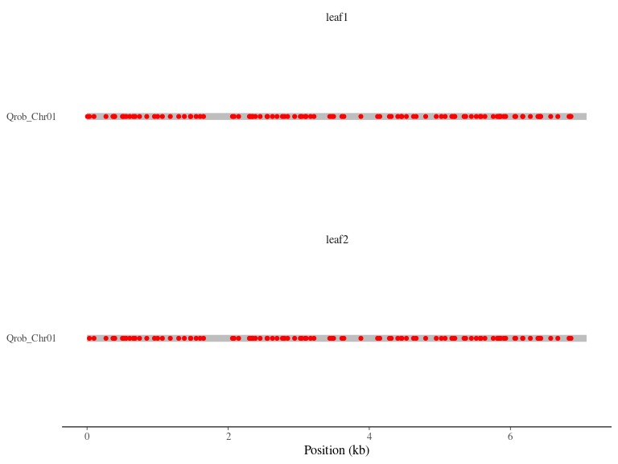

Snakemake & Singularity lecture
================
Sylvain Schmitt
January 4th, 2022

  - [Installation](#installation)
  - [Data](#data)
  - [Usage](#usage)
      - [Locally](#locally)
      - [HPC](#hpc)
  - [Workflow](#workflow)
      - [Reference](#reference)
      - [Reads](#reads)
      - [Alignments](#alignments)
      - [Mutations](#mutations)
      - [Quality check](#quality-check)
      - [Plot and check results](#plot-and-check-results)

[`singularity` &
`snakemake`](https://github.com/sylvainschmitt/snakemake_singularity)
workflow for a lecture at ECOFOG.

<!-- -->

# Installation

  - [x] Python ≥3.5
  - [x] Snakemake ≥5.24.1
  - [x] Golang ≥1.15.2
  - [x] Singularity ≥3.7.3
  - [x] This workflow

<!-- end list -->

``` bash
# Python
sudo apt-get install python3.5
# Snakemake
sudo apt install snakemake`
# Golang
export VERSION=1.15.8 OS=linux ARCH=amd64  # change this as you need
wget -O /tmp/go${VERSION}.${OS}-${ARCH}.tar.gz https://dl.google.com/go/go${VERSION}.${OS}-${ARCH}.tar.gz && \
sudo tar -C /usr/local -xzf /tmp/go${VERSION}.${OS}-${ARCH}.tar.gz
echo 'export GOPATH=${HOME}/go' >> ~/.bashrc && \
echo 'export PATH=/usr/local/go/bin:${PATH}:${GOPATH}/bin' >> ~/.bashrc && \
source ~/.bashrc
# Singularity
mkdir -p ${GOPATH}/src/github.com/sylabs && \
  cd ${GOPATH}/src/github.com/sylabs && \
  git clone https://github.com/sylabs/singularity.git && \
  cd singularity
git checkout v3.7.3
cd ${GOPATH}/src/github.com/sylabs/singularity && \
  ./mconfig && \
  cd ./builddir && \
  make && \
  sudo make install
# snakemake Lecture
git clone git@github.com:sylvainschmitt/snakemakeLecture.git
cd snakemakeLecture
```

# Data

Run `get_data.sh` in the `data` directory.

``` bash
git clone git@github.com:sylvainschmitt/generateMutations.git
cd generateMutations/data
sh get_data.sh
cd ..
snakemake --use-singularity --cores 4
mv results/reference/ ../
mv results/reads/ ../
mv results/mutations/ ../
cd ..
rm -rf generateMutations
```

# Usage

## Locally

``` bash
snakemake -np -j 3 --resources mem_mb=10000 # dry run
snakemake --dag | dot -Tsvg > dag/dag.svg # dag
snakemake --use-singularity -j 3 --resources mem_mb=10000 # run
```

## HPC

``` bash
module load bioinfo/snakemake-5.25.0 # for test on node
snakemake -np # dry run
sbatch job.sh # run
snakemake --dag | dot -Tsvg > dag/dag.svg # dag
```

# Workflow

## Reference

*Copy and index reference.*

### [cp\_reference](https://github.com/sylvainschmitt/snakemakeLecture/blob/main/rules/cp_reference.smk)

  - Tools: `cp`

### [bwa\_index](https://github.com/sylvainschmitt/snakemakeLecture/blob/main/rules/bwa_index.smk)

  - Tools: [`BWA index`](http://bio-bwa.sourceforge.net/bwa.shtml)
  - Singularity:
    oras://registry.forgemia.inra.fr/gafl/singularity/bwa/bwa:latest

## Reads

*Trim and quality check reads.*

### [trimmomatic](https://github.com/sylvainschmitt/snakemakeLecture/blob/main/rules/trimmomatic.smk)

  - Tools:
    [`Trimmomatic`](http://www.usadellab.org/cms/uploads/supplementary/Trimmomatic/TrimmomaticManual_V0.32.pdf)
  - Singularity:
    oras://registry.forgemia.inra.fr/gafl/singularity/trimmomatic/trimmomatic:latest

### [fastqc](https://github.com/sylvainschmitt/snakemakeLecture/blob/main/rules/fastqc.smk)

  - Tools:
    [`fastQC`](https://www.bioinformatics.babraham.ac.uk/projects/fastqc/Help/)
  - Singularity: docker://biocontainers/fastqc:v0.11.9\_cv8

## Alignments

*Align reads against reference, mark duplicated, and report alignment
quality.*

### [bwa\_mem](https://github.com/sylvainschmitt/snakemakeLecture/blob/main/rules/bwa_mem.smk)

  - Tools: [`BWA mem`](http://bio-bwa.sourceforge.net/bwa.shtml)
  - Singularity:
    oras://registry.forgemia.inra.fr/gafl/singularity/bwa/bwa:latest

### [samtools\_view](https://github.com/sylvainschmitt/snakemakeLecture/blob/main/rules/samtools_view.smk)

  - Tools: [`Samtools
    view`](http://www.htslib.org/doc/samtools-view.html)
  - Singularity:
    oras://registry.forgemia.inra.fr/gafl/singularity/samtools/samtools:latest

### [samtools\_sort](https://github.com/sylvainschmitt/snakemakeLecture/blob/main/rules/samtools_sort.smk)

  - Tools: [`Samtools
    sort`](http://www.htslib.org/doc/samtools-sort.html)
  - Singularity:
    oras://registry.forgemia.inra.fr/gafl/singularity/samtools/samtools:latest

### [samtools\_index](https://github.com/sylvainschmitt/snakemakeLecture/blob/main/rules/samtools_index.smk)

  - Tools: [`Samtools
    index`](http://www.htslib.org/doc/samtools-index.html)
  - Singularity:
    oras://registry.forgemia.inra.fr/gafl/singularity/samtools/samtools:latest

### [gatk\_markduplicates](https://github.com/sylvainschmitt/snakemakeLecture/blob/main/rules/gatk_markduplicates.smk)

  - Tools: [`gatk
    MarkDuplicates`](https://gatk.broadinstitute.org/hc/en-us/articles/360037052812-MarkDuplicates-Picard-)
  - Singularity: docker://broadinstitute/gatk

### [samtools\_view\_md](https://github.com/sylvainschmitt/snakemakeLecture/blob/main/rules/samtools_view_md.smk)

  - Tools: [`Samtools
    view`](http://www.htslib.org/doc/samtools-view.html)
  - Singularity:
    oras://registry.forgemia.inra.fr/gafl/singularity/samtools/samtools:latest

### [samtools\_index\_md](https://github.com/sylvainschmitt/snakemakeLecture/blob/main/rules/samtools_index_md.smk)

  - Tools: [`Samtools
    index`](http://www.htslib.org/doc/samtools-index.html)
  - Singularity:
    oras://registry.forgemia.inra.fr/gafl/singularity/samtools/samtools:latest

### [samtools\_stats](https://github.com/sylvainschmitt/snakemakeLecture/blob/main/rules/samtools_stats.smk)

  - Tools: [`Samtools
    stats`](http://www.htslib.org/doc/samtools-stats.html)
  - Singularity:
    oras://registry.forgemia.inra.fr/gafl/singularity/samtools/samtools:latest

### [mosdepth](https://github.com/sylvainschmitt/snakemakeLecture/blob/main/rules/mosdepth.smk)

  - Tools: [`mosdepth`](https://github.com/brentp/mosdepth)
  - Singularity:
    docker://quay.io/biocontainers/mosdepth:0.2.4–he527e40\_0

## Mutations

*Detect mutations.*

### [strelka2](https://github.com/sylvainschmitt/snakemakeLecture/blob/main/rules/strelka2.smk)

  - Tools: [`Strelka2`](https://github.com/Illumina/strelka)
  - Singularity: docker://quay.io/wtsicgp/strelka2-manta

### [bedtools\_subtract](https://github.com/sylvainschmitt/snakemakeLecture/blob/main/rules/bedtools_subtract.smk)

  - Tools: [`bedtools
    subtract`](https://bedtools.readthedocs.io/en/latest/content/tools/subtract.html)
  - Singularity:
    oras://registry.forgemia.inra.fr/gafl/singularity/bedtools/bedtools:latest

### [strelka2tsv](https://github.com/sylvainschmitt/snakemakeLecture/blob/main/rules/strelka2tsv.smk)

  - Script:
    [`strelka2tsv.R`](https://github.com/sylvainschmitt/snakemakeLecture/blob/main/scripts/strelka2tsv.R)
  - Singularity:
    <https://github.com/sylvainschmitt/singularity-r-bioinfo/releases/download/0.0.3/sylvainschmitt-singularity-r-bioinfo.latest.sif>

## Quality check

*Report all quality checks together.*

### [multiqc](https://github.com/sylvainschmitt/snakemakeLecture/blob/main/rules/multiqc.smk)

  - Tools: [`MultiQC`](https://multiqc.info/)
  - Singularity:
    oras://registry.forgemia.inra.fr/gafl/singularity/multiqc/multiqc:latest

## Plot and check results

<!-- -->

<table>

<thead>

<tr>

<th style="text-align:left;">

CHROM

</th>

<th style="text-align:right;">

POS

</th>

<th style="text-align:left;">

REF

</th>

<th style="text-align:left;">

TYPE

</th>

<th style="text-align:left;">

ALT

</th>

<th style="text-align:right;">

true

</th>

<th style="text-align:right;">

leaf1

</th>

<th style="text-align:right;">

leaf2

</th>

</tr>

</thead>

<tbody>

<tr>

<td style="text-align:left;">

Qrob\_Chr01

</td>

<td style="text-align:right;">

6

</td>

<td style="text-align:left;">

A

</td>

<td style="text-align:left;">

transversion2

</td>

<td style="text-align:left;">

T

</td>

<td style="text-align:right;">

1

</td>

<td style="text-align:right;">

1

</td>

<td style="text-align:right;">

0

</td>

</tr>

</tbody>

</table>
